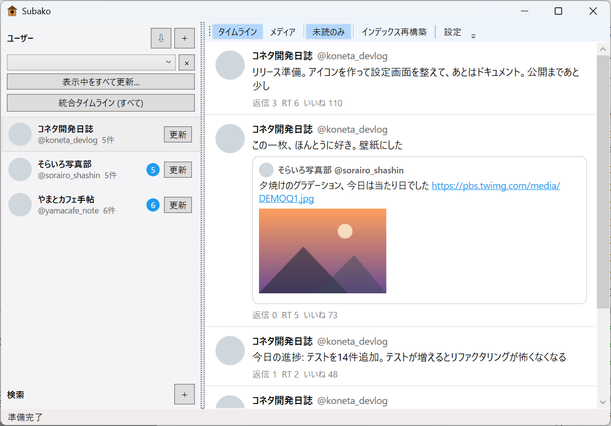

# Subako (巣箱)

[](https://github.com/lichten/subako/actions/workflows/ci.yml)
[](LICENSE)
[](../../releases)


X (Twitter) の特定ユーザーのツイートを**全期間ローカルに保存**し、オフラインで
快適に閲覧する Windows アプリです。取得には [Sorsa API](https://api.sorsa.io) を
利用します (API キーは各自で取得)。

- ユーザー単位の全期間アーカイブ (本文・画像を原寸で保存)
- 未読管理 / タグ分類 / キーワード検索の保存 / 全アカウント混合の統合タイムライン
- メディアグリッド表示と画像ビューア
- データはすべてローカルの JSONL + SQLite。クラウド同期フォルダに置けば複数 PC で共有可能
- **閲覧だけなら Python も API キーも不要**



## インストール

1. [Releases](../../releases) から zip 版またはインストーラーをダウンロード
2. 起動すると初回セットアップが開くので、ツイートデータの保存先フォルダを選ぶ
3. 閲覧だけならこれで完了 (別 PC で取得済みのデータフォルダを選べばそのまま読めます)

.NET ランタイムのインストールは不要です (同梱)。

## ツイートを取得できるようにする

取得機能には Python 3 と Sorsa API キーが必要です。

1. [Python 3](https://www.python.org/) をインストール
2. アプリのインストール先フォルダで依存パッケージを導入:
   ```powershell
   pip install -r requirements.txt
   ```
3. [Sorsa API](https://api.sorsa.io) でアカウントを作成し、ダッシュボードから
   API キーを取得 (新規アカウントに 100 リクエストの無料枠あり)
4. インストール先の `.env.example` を `.env` にコピーし、`SORSA_API_KEY=` に
   キーを記入
5. アプリのサイドバーの ＋ からユーザーを追加し、「更新」で取得

費用の目安: 課金はリクエスト単位 (Pro プランで $0.00199/リクエスト、1 ページ≒20 件
なので約 $0.10/1,000 ツイート)。大きなアカウントを取得する前に無料枠で試してください。

## 主な機能の使い方

- **ユーザー追加**: サイドバー「ユーザー」の ＋。追加後にそのまま取得を開始できます
- **更新 / バックフィル**: ユーザー行の右クリックメニュー。取得はリクエスト数の
  上限を指定でき、中断しても続きから再開できます
- **タグ**: 行の右クリック → タグ。上部のドロップダウンでタグ絞り込み
  (「(タグなし)」で未分類だけの表示も可能)
- **キーワード検索の保存**: 「検索」の ＋ で X 全体を検索して保存。以後は差分更新できます
- **フォロー中の一括登録**: ユーザーヘッダの ⇩ で、指定アカウントのフォロー先を
  タグ付きでまとめて登録
- **統合タイムライン**: 表示中のユーザー・検索を全部混ぜた時系列表示
- 取得した内容はスクロールに応じて自動で既読になります (「未読のみ」フィルタあり)

## 制限・既知の事項

- Windows 専用・日本語 UI のみ
- Sorsa は `/user-tweets` で全期間の取得に対応するとしていますが、実際の取得件数は
  プロフィール上のツイート数より少なくなることがあります (削除済み・非公開期間の分は
  取得できません)。遡りが足りない場合はバックフィルで補完を試みます
- 不具合報告の際は `%APPDATA%\Subako\logs\` のログファイルを添付してください

## コマンドライン (上級者向け)

ビューアを介さず fetcher を直接実行できます (インストール先、またはリポジトリの
フォルダで):

```powershell
python main.py <username>                 # 全期間取得
python main.py <username> --max-pages 2   # 試験実行
python main.py --search "<query>"         # キーワード検索
```

| オプション | 説明 |
|---|---|
| `--output-dir DIR` | 保存先(既定: `data`) |
| `--max-pages N` | タイムライン取得の最大ページ数(試験用。1ページ≒20件) |
| `--max-requests N` | この実行で使う API リクエスト数の上限 |
| `--skip-images` | 画像をダウンロードしない |
| `--backfill` | タイムラインで遡り切れなかった期間を `search-tweets` の期間分割検索で補完 |
| `--fresh` | 進捗(state.json)を無視して最初からページングし直す(重複保存はされない) |
| `--rps N` | リクエストレート上限(既定 5、Sorsa の上限は 20) |
| `--followings` | `username` がフォロー中の一覧を `_followings/<username>.jsonl` に書き出す(ツイートは取得しない。ビューアの一括登録用) |
| `--images-only` | API を使わず、保存済み JSONL から未取得の画像だけ補完 |

出力は `data/<username>/` に `tweets.jsonl` (生 JSON を 1 行 1 件) + `images/` +
`state.json` (進捗)。中断しても再実行すれば続きから再開します。詳細な仕様は
[docs/data-layer.md](docs/data-layer.md) を参照してください。

## 免責事項・利用上の注意

- 本ソフトウェアは個人が開発した非公式ツールであり、X Corp. および Sorsa とは
  一切関係ありません。
- Sorsa API の利用 (アカウント作成・API キーの管理・課金・利用規約の遵守) は
  利用者自身の責任で行ってください。
- 取得したツイート・画像は第三者の著作物です。私的利用の範囲に留め、
  取得データの再配布・再公開は行わないでください。
- 本ツールの利用にあたっては X の利用規約およびコンテンツ表示に関する
  ポリシーを利用者自身が確認・遵守してください。
- 本ソフトウェアは無保証です (LICENSE 参照)。利用によって生じたいかなる
  損害についても作者は責任を負いません。

## 開発者向け

### ドキュメント

- [docs/data-layer.md](docs/data-layer.md) — データ層仕様 (プラットフォームフリー。JSONL・SQLite・画像命名)
- [docs/viewer-features.md](docs/viewer-features.md) — ビューア機能仕様 (全機能の挙動)
- [docs/fetcher-cli.md](docs/fetcher-cli.md) — fetcher CLI 契約と Sorsa API 概要
- [docs/mac-port-notes.md](docs/mac-port-notes.md) — 別プラットフォーム (Mac 等) 実装時の要点

### セットアップ

```powershell
python -m venv .venv
.venv\Scripts\Activate.ps1
pip install -r requirements.txt
copy .env.example .env
# .env を開いて SORSA_API_KEY に実際のキーを設定
```

### テスト

```powershell
pip install -r requirements-dev.txt
pytest                                  # Python 側 (API は消費しない)
dotnet test viewer\TweetViewer.Tests\TweetViewer.Tests.csproj   # ビューア側
```

`pytest` は偽クライアントを差し込むので API キーもネットワークも不要です。
ビューアが起動中だと exe がロックされて `dotnet test` が失敗するので、先に終了してください。

疎通確認には `python probe.py <username>` (2 リクエスト消費、生レスポンスを
`probe_output/` に保存) が使えます。

### 配布物の作成

```powershell
dotnet publish viewer\TweetViewer\TweetViewer.csproj -c Release -p:PublishProfile=win-x64
```

出力は `viewer\TweetViewer\bin\publish\win-x64\` (self-contained 単一 exe +
fetcher 一式 + ライセンス表記)。配布用の zip・インストーラーは**必ずこの出力
フォルダからのみ**作成すること。リポジトリの作業ツリーを直接 zip しない —
作業ツリーには gitignore されているだけの非公開ファイル (`.env` の API キー、
`data/` の取得済みアーカイブ、`probe_output/` の生 API 応答) が存在するため。

リリースは `git tag vX.Y.Z && git push origin vX.Y.Z` で GitHub Actions が
zip + インストーラー付きのドラフト Release を作成する (csproj の `<Version>` を
タグと一致させておくこと)。

## ライセンス

MIT License — [LICENSE](LICENSE) を参照。同梱するサードパーティソフトウェアの
ライセンスは [THIRD-PARTY-NOTICES.md](THIRD-PARTY-NOTICES.md) を参照してください。
